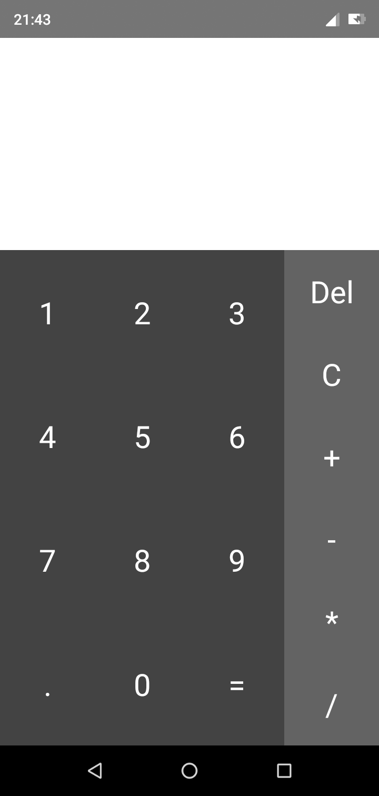

## React Native Calculator App

A simple cross platform (iOS and Android) React Native calculator app. Get started learning & mastering React Native for free!

### Installation

- `git clone https://github.com/Stanely254/CalculatorReactNative`
- `yarn install`/`npm install`

### Running

- `yarn run ios`/`npm run ios` or `yarn run android`/`npm run android`

---

This project was put together to serve as an example to help you in building your own React Native apps. Feel free to download it and use the code

### Acknowledgements
- [FreeCodeCamp](https://freecodecamp.org)
- etc.